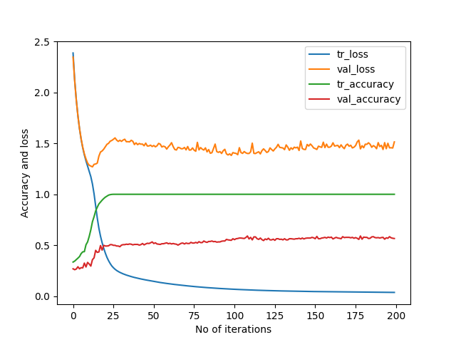

# DrivingDirection-7
99/99 [==============================] - 0s 3ms/step - loss: 0.0366 - accuracy: 1.0000 - val_loss: 1.5143 - val_accuracy: 0.5660   
[[175  23  18]    
 [ 62  24   8]    
 [ 58  25  54]]   
99/99 [==============================] - 0s 1ms/step - loss: 0.0608 - accuracy: 1.0000    
14/14 [==============================] - 0s 2ms/step - loss: 1.4007 - accuracy: 0.5906    
Train: 1.000, Test: 0.591    
[[168  32  16]               
 [ 49  33  12]               
 [ 54  20  63]]              
 
 
